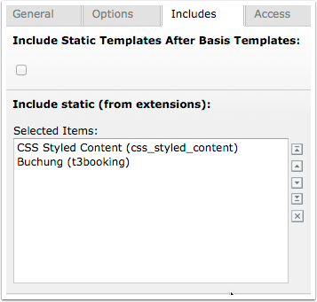
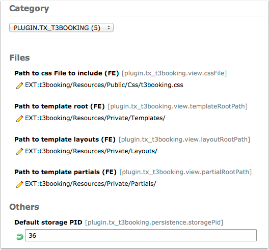

.. ==================================================
.. FOR YOUR INFORMATION
.. --------------------------------------------------
.. -*- coding: utf-8 -*- with BOM.

.. include:: ../Includes.txt

.. _admin-manual:

Administrator Manual
====================

Target group: **Administrators**

.. _admin-installation:

Installation
------------

To install the extension, perform the following steps:

#. Go to the Extension Manager
#. Install the extension
#. Load the static template
#. Configure according to your requirements

For a list of configuration options, using a definition list is recommended:

Some Configuration
  This option enables...

Other configuration
  This other option is for all the rest...

   Static Template (caption of the image)

   Include the static template in you your page template

.. _admin-configuration:

Configuration
-------------

   Configuration Manager (caption of the image)

   Define basic settings. The storage PID matters.

